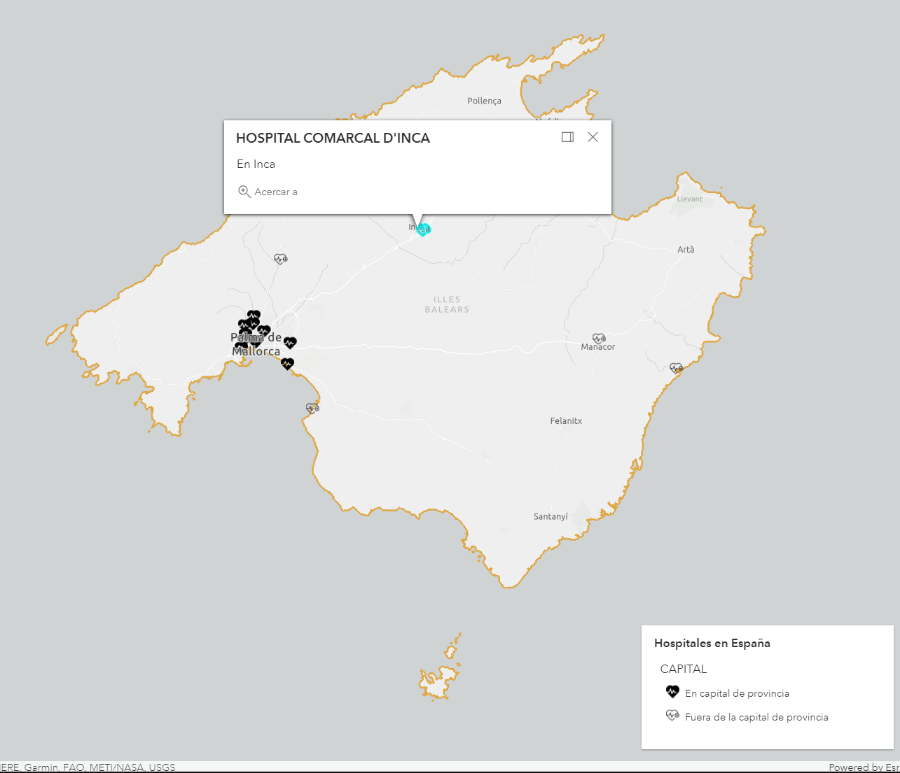
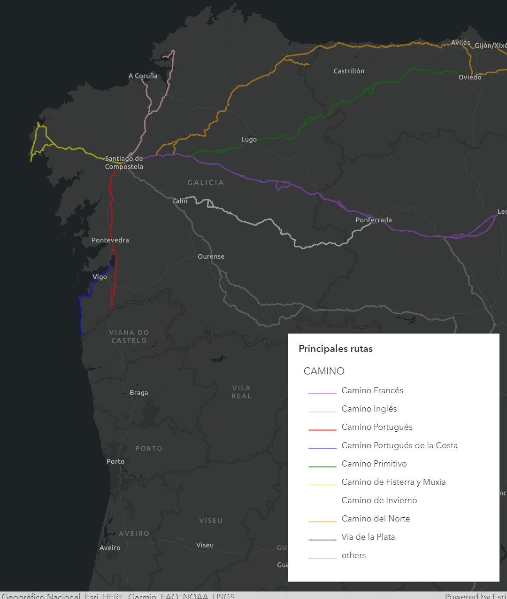
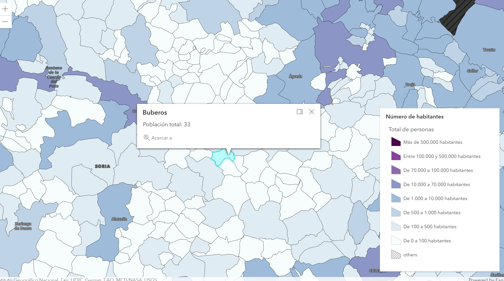
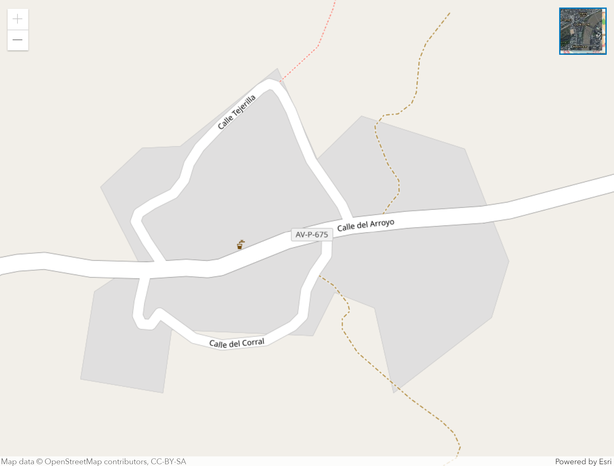
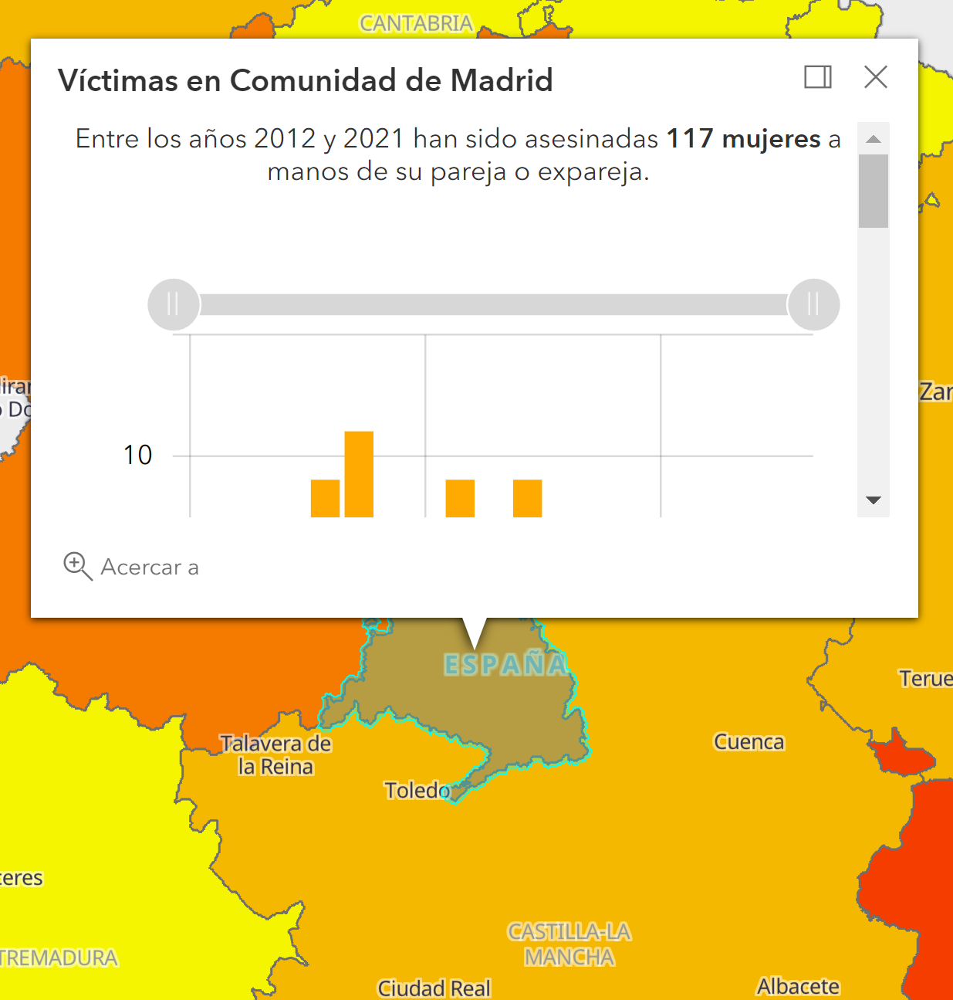
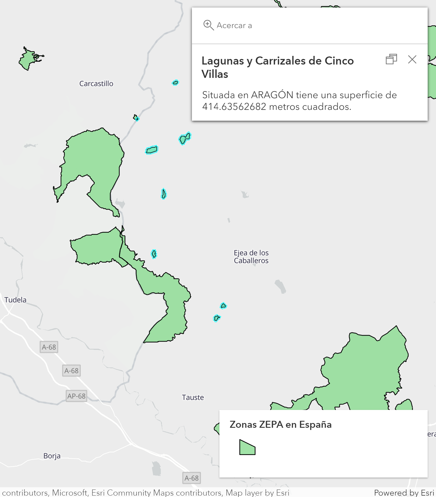
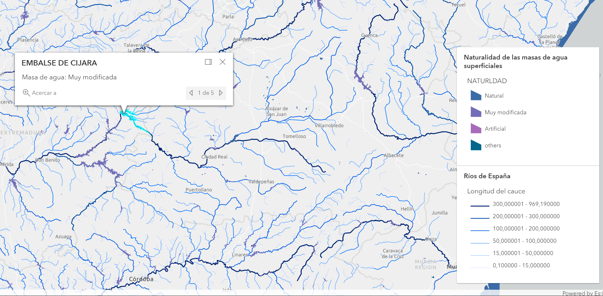
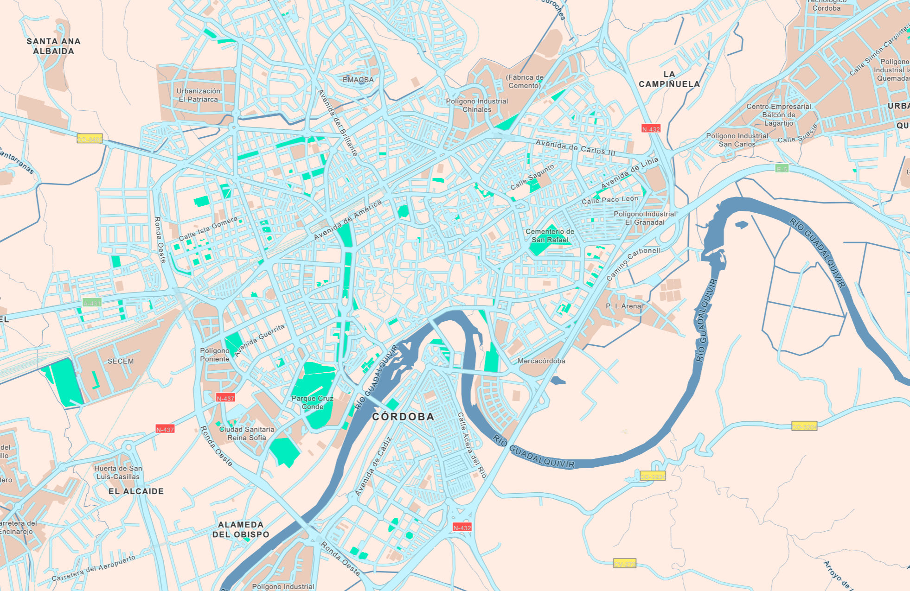
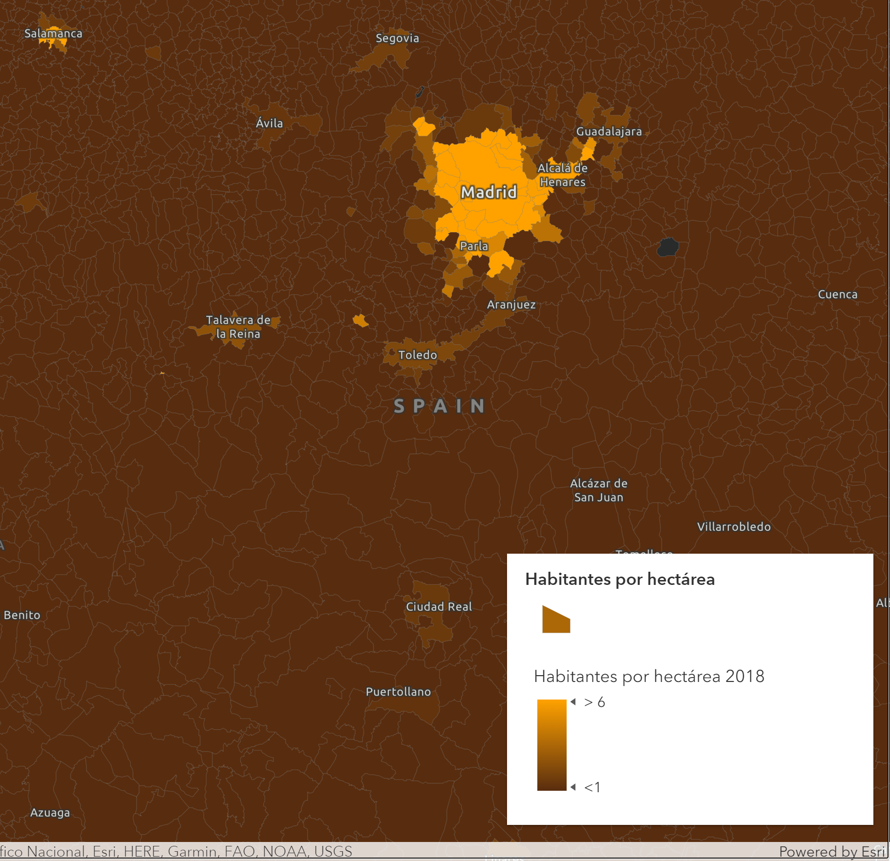
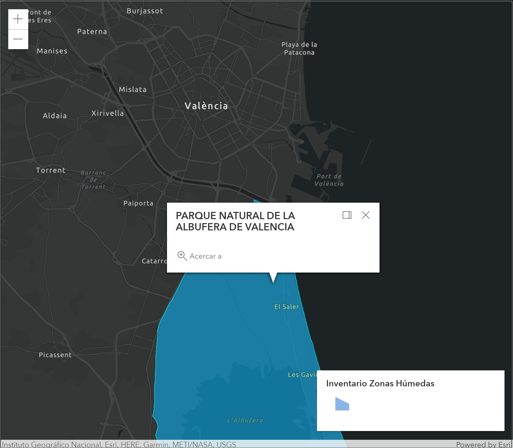

# #30DayMapChallenge

## Day 1 - Points

## Day 2 - Lines

## Day 3 - Polygons

## Day 4 - Hexagons

## Day 5 - Data challenge 1: OpenStreetMap

## Day 6 - Red

## Day 7 - Green

## Day 8 - Blue

## Day 9 - Monochrome

## Day 10 - Raster
## Day 11 - 3D

## Day 12 - Population

## Day 13 - Data challenge 2: Natural Earth

## Day 14 - Map with a new tool
## Day 15 - Map made without a computer
## Day 16 - Urban/rural
## Day 17 - Land
## Day 18 - Water
## Day 19 - Island(s)
## Day 20 - Movement
## Day 21 - Elevation
## Day 22 - Boundaries
## Day 23 - Data challenge 3: GHSL
## Day 24 - Historical map
## Day 25 - Interactive map
## Day 26 - Choropleth map
## Day 27 - Heatmap
## Day 28 - The Earth is not flat
## Day 29 - NULL
## Day 30 - Metamapping day

